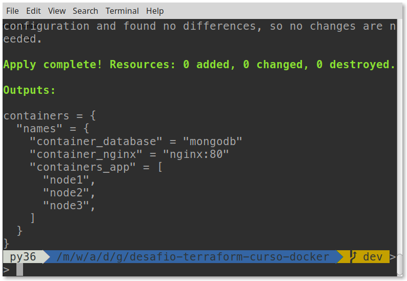

# desafio-terraform-curso-docker

[](https://github.com/adrianoavelino)
[](https://img.shields.io/github/repo-size/my-study-area/desafio-terraform-curso-docker)
[](https://github.com/my-study-area/desafio-terraform-curso-docker/commits/main)

Repositório criado com o objetivo de assimilar os conhecimento adquiridos com terraform e docker



Projeto desenvolvido com o intuito de assimilar os conhecimentos adquiridos nos estudos de Terrafom da [Zup Edu](https://github.com/adrianoavelino/zupedu-curso-terraform) e [Alura](https://github.com/my-study-area/curso-alura-terraform). Uma forma interessante para consolidar os conhecimentos é aplicar em um novo projeto ou em um projeto já existente, mas neste caso foi aplicado os conhecimentos de Terraform para inciar uma aplicação desenvolvida no [Curso de Docker: Criando containers sem dor de cabeça ](https://github.com/my-study-area/curso-alura-docker) da Alura, mas utilizando Terraform.

## Processo de desenvolvimento:
- relembrar os passos necessários para execução da aplicação com docker-compose e atualização do readme no Projeto do Curso de Docker
- adicionar os comandos utilizados para executar a aplicação utilizando somente o docker para executar os containers, criar networks e configurá-los 
- [Envio das imagens para do Docker Hub](https://hub.docker.com/u/adrianoavelino)
  - [Atualização das dependências da aplicação em Node](https://github.com/my-study-area/curso-alura-docker#atualiza%C3%A7%C3%B5es)
  - [Atualização da sintaxe das views da aplicação que utilizam marko](https://github.com/my-study-area/curso-alura-docker#atualiza%C3%A7%C3%B5es)
  - [Atualização das dependência da aplicação](https://github.com/my-study-area/curso-alura-docker#atualiza%C3%A7%C3%B5es)
- Converção do projeto de docker-compose para Terraform
  - pesquisa sobre a criação de networks e configuração nos containers no Terraform

# Tecnologias
- Terraform
- Docker
- tfenv para versionamento

# Iniciando o projeto
```bash
# clona o projeto
git clone https://github.com/my-study-area/desafio-terraform-curso-docker

# entra no diretório
cd desafio-terraform-curso-docker

# verifica versão do terraform
terraform -v #Terraform v1.1.9

# prepara o diretório de trabalho instalando os providers 
# necessários e etc
terraform init

# mostra as modificações que serão aplicadas
terraform plan

# cria ou atualiza a infraestrutura
terraform apply -auto-approve

# lista os containers em execução
docker ps

# alimenta o banco de dados com os dados inciais
# Obs: também é possível acessar http://localhost/seed no navegador
curl http://localhost/seed -v
```
Para visualizar a aplicação em execução acesse [http://localhost/](http://localhost/).
> A execução dos comandos está disponível no Youtube, [no canal Diário de um dev](https://youtu.be/fYhgI4kO8-0)

# Passos para iniciar a aplicação com docker
```bash
# cria a rede my_network
docker network create --driver bridge my_network

# executa o mongo
docker run -d --name mongodb --network my_network mongo

# executa o container com node1
docker run -d --name node1 --network my_network adrianoavelino/alura-books:0.2

# executa o container com node2
docker run -d --name node2 --network my_network adrianoavelino/alura-books:0.2

# executa o container com node3
docker run -d --name node3 --network my_network adrianoavelino/alura-books:0.2

# executa o nginx como controle de carga
docker run -d --name nginx -p 80:80 --network my_network \
adrianoavelino/nginx-curso-alura-docker:0.1

# verifica os logs do container node1
docker logs -f node1

# verifica os logs do container node2
docker logs -f node2

# verifica os logs do container node3
docker logs -f node3
```
